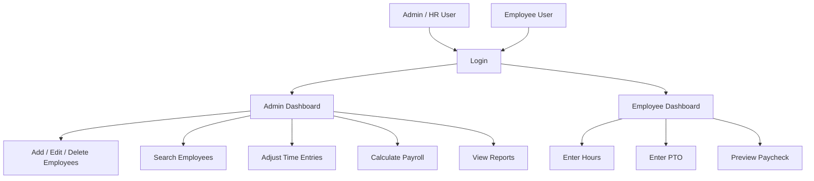
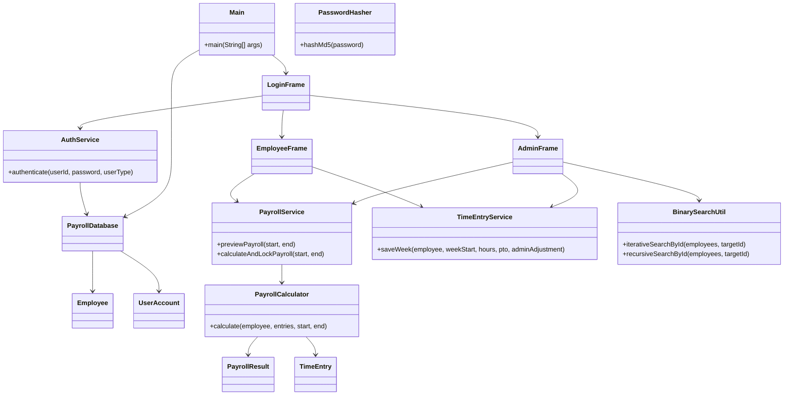
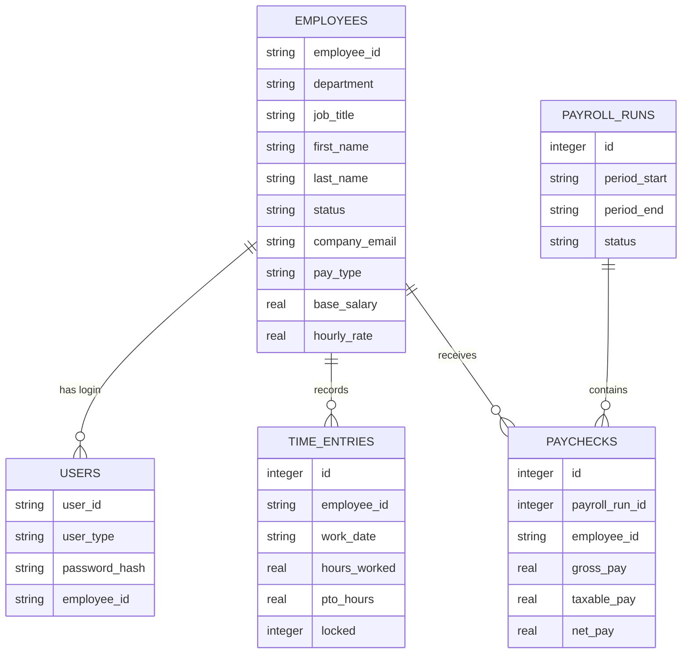

# Payroll System UML

## Use Case Diagram

```mermaid
flowchart TD
    Admin["Admin / HR User"] --> Login["Login"]
    Employee["Employee User"] --> Login
    Login --> AdminDashboard["Admin Dashboard"]
    Login --> EmployeeDashboard["Employee Dashboard"]
    AdminDashboard --> ManageEmployees["Add / Edit / Delete Employees"]
    AdminDashboard --> SearchEmployees["Search Employees"]
    AdminDashboard --> AdjustTime["Adjust Time Entries"]
    AdminDashboard --> CalculatePayroll["Calculate Payroll"]
    AdminDashboard --> Reports["View Reports"]
    EmployeeDashboard --> EnterHours["Enter Hours"]
    EmployeeDashboard --> EnterPTO["Enter PTO"]
    EmployeeDashboard --> PreviewPaycheck["Preview Paycheck"]
```

## Class Diagram

```mermaid
classDiagram
    class Main {
        +main(String[] args)
    }
    class LoginFrame
    class AdminFrame
    class EmployeeFrame
    class PayrollDatabase
    class AuthService {
        +authenticate(userId, password, userType)
    }
    class PasswordHasher {
        +hashMd5(password)
    }
    class Employee
    class UserAccount
    class PayrollService {
        +previewPayroll(start, end)
        +calculateAndLockPayroll(start, end)
    }
    class PayrollCalculator {
        +calculate(employee, entries, start, end)
    }
    class TimeEntryService {
        +saveWeek(employee, weekStart, hours, pto, adminAdjustment)
    }
    class BinarySearchUtil {
        +iterativeSearchById(employees, targetId)
        +recursiveSearchById(employees, targetId)
    }
    class PayrollResult
    class TimeEntry

    Main --> PayrollDatabase
    Main --> LoginFrame
    LoginFrame --> AuthService
    LoginFrame --> AdminFrame
    LoginFrame --> EmployeeFrame
    AuthService --> PayrollDatabase
    PayrollDatabase --> Employee
    PayrollDatabase --> UserAccount
    AdminFrame --> PayrollService
    AdminFrame --> TimeEntryService
    AdminFrame --> BinarySearchUtil
    EmployeeFrame --> PayrollService
    EmployeeFrame --> TimeEntryService
    PayrollService --> PayrollCalculator
    PayrollCalculator --> PayrollResult
    PayrollCalculator --> TimeEntry
```

## Database Relationship Diagram

```mermaid
erDiagram
    EMPLOYEES ||--o{ USERS : "has login"
    EMPLOYEES ||--o{ TIME_ENTRIES : "records"
    EMPLOYEES ||--o{ PAYCHECKS : "receives"
    PAYROLL_RUNS ||--o{ PAYCHECKS : "contains"

    EMPLOYEES {
        string employee_id
        string department
        string job_title
        string first_name
        string last_name
        string status
        string company_email
        string pay_type
        real base_salary
        real hourly_rate
    }

    USERS {
        string user_id
        string user_type
        string password_hash
        string employee_id
    }

    TIME_ENTRIES {
        integer id
        string employee_id
        string work_date
        real hours_worked
        real pto_hours
        integer locked
    }

    PAYROLL_RUNS {
        integer id
        string period_start
        string period_end
        string status
    }

    PAYCHECKS {
        integer id
        integer payroll_run_id
        string employee_id
        real gross_pay
        real taxable_pay
        real net_pay
    }
```
